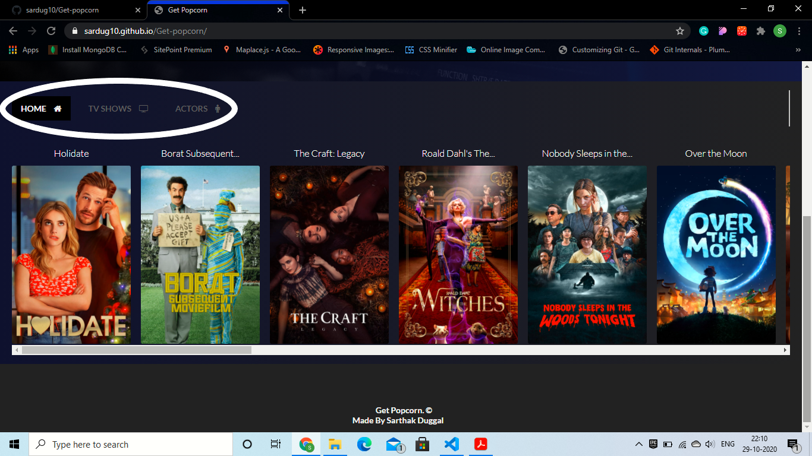
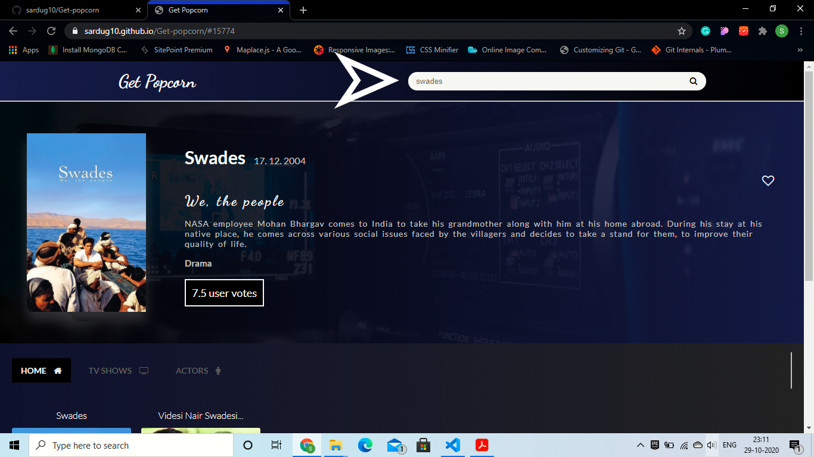
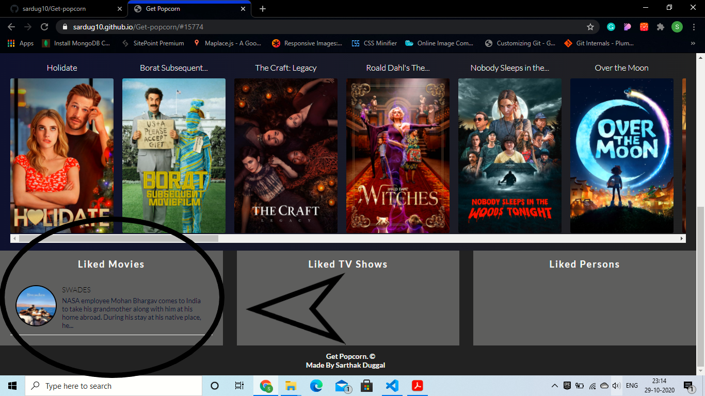
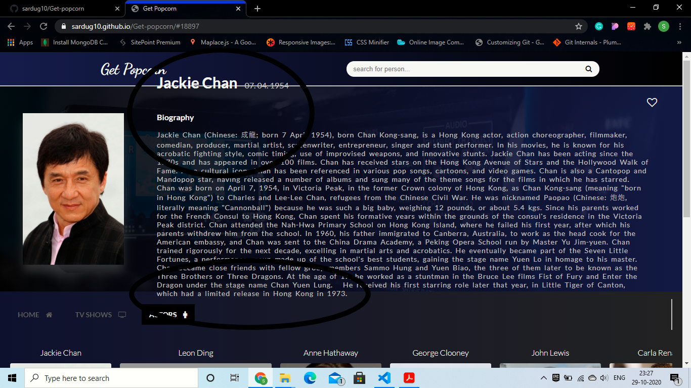

### Get Popcorn

This is a Web-Application I build as my personal project. It shows stuff like Trending movies, TV shows and actors. There is a lot of stuff that you can do. If you want to try click [here](https://sardug10.github.io/Get-popcorn/).
If you want to contribute or learn more then keep reading.

#### Trending Section

When the page loads, at the bottom, you can see the Top-20 Trending movies of the day i.e, movie's title and the Poster.

##### Different Tabs

You can switch between different tabs i.e, Movies, TV Shows and Actors and you will be able to see the Trending stuff accordingly.

#### Details

All the Posters you can see in the Trending Section are links. Click on any one of them and you will be able to see the details of that particular movie, TV show or actor above this section.

#### Search Bar

Also, you can search for your favorite movies, TV shows or actors in the search bar up top and wen you press enter, it will show all results related to that search in the place of trending section.

##### Note:- If you want to search for a movie, make sure that your movies tab is active and same for the TV shows and Actors.

#### Like your favorite stuff

Click on the little **HEART ICON** and you can like your favorite movies, TV shows or actors and it will remain intact in Local Storage for future. All the movies, Tv shows and actors you liked will appear at the very bottom of the page.

##### Note:- These UI elements so created are also Links and works just as other links i.e, you can get the details for the same by just clicking on it.

### How to contribute?
You can contribute to this project in number of ways, it's upto your imagination. Also, if you want some suggestions about what you can do to contribute, I have listed you 2 issues that you can fix:-

1. **Not enough space for the details**
    If you click on some of the movies, TV shows or Actors to see their details, in some of the cases the details overflows the same as shown in the image below. So, you can do something to fix this like you can put the word limit such that it just occupies same space in each case. Rest upto your imaginations.

2. **Showing liked movies, Tv shows and actors seperately**
    Currently, liked movies, Tv shows and actors are visible at the same time no matter which tab is active. This creates an issue that, if you click on any of your liked TV show while your some other tab is active, it will show you the details of some different thing because the API used is different for each category so it will always use the API according to the active tab. You can try and see it on your own.

3. **You can make this website responsive**
    This web application is not responsive as of now. Try to make it so according to your imaginations.

### If you think you like this project, don't forget to give it a star!!
